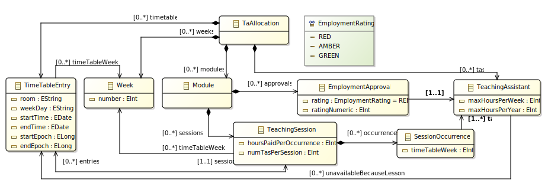

# Reoptimisation Paper 2025 Example

[**GIPS**](https://github.com/Echtzeitsysteme/gips) is an open-source framework for **G**raph-Based (M)**I**LP **P**roblem **S**pecification.
This repository holds the GIPS example projects for the reoptimisation paper 2025 paper.

## Setup

* Install [GIPS](https://github.com/Echtzeitsysteme/gips) as described in its [repository](https://github.com/Echtzeitsysteme/gips).
    * Alternatively, the GIPS team offers [pre-built Eclipse IDE build](https://github.com/Echtzeitsysteme/gips-eclipse-build/releases) ready to be used to open GIPS projects.
* Launch a runtime workspace (while using a development workspace in Eclipse) as stated in the eMoflon::IBeX installation steps. (Please refer to the installation steps of GIPS above.)
* Import all projects contained in this repository.
* Build all your projects with the black eMoflon hammer. Sometimes, it is required to trigger a cleaning in Eclipse (*Project -> Clean... -> Clean all projects*).
* Some of the projects have a runnable Java class with a `main` function.
* You can now launch a GIPS project like `teachingassistant.uni.plaster.basic`:
    * Go to `teachingassistant.uni.plaster.basic` -> `src` -> `teachingassistant.uni.plaster.basic.runner` in the project explorer.
    * Launch `TaPlasterBasicPipelineRunner.java` with a right click -> _Run As_ -> _Java_.

## Eclipse Project Overview

| **Name**                                     | **Description**                                                                                             |
| -------------------------------------------- | ----------------------------------------------------------------------------------------------------------- |
| `teachingassistant.metamodel`                | Eclipse Modeling Framework (EMF) metamodel project                                                          |
| `teachingassistant.uni.batch`                | Original GIPSL project to solve the original optimisation                                                   |
| `teachingassistant.uni.plaster.basic`        | Reoptimisation specification corresponding to *basic plaster* search operators                              |
| `teachingassistant.uni.plaster.smart`        | Reoptimisation specification corresponding to *smart plaster* search operators                              |
| `teachingassistant.uni.plaster.set `         | Reoptimisation specification corresponding to *plaster sets*, allowing multiple search operator application |
| `teachingassistant.uni.recomp`               | Reoptimisation specification for a full recomputation                                                       |
| `teachingassistant.uni.recomp.preprocessing` | Preprocessing for the full recomputation solution                                                           |
| `teachingassistant.uni.utils`                | Utilities and helpers                                                                                       |

## Detailed Example Information

In the example scenario, the task is to assign Teaching Assistants (TAs) to university courses while holding various constraints and optimising an objective function.
The original implementation based on GIPS can be found in the project `teachingassistant.uni.batch`.
All implementations contained in this repository refer to the metamodel in the project `teachingassistant.metamodel`.

### Metamodel

The following Figure shows a slightly simplified visualisation of the metamodel.
(Compared to the Figure, the implemented metamodel also features an abstract type `NamedElement` with a `String` attribute from which every other class inherits.
This can be used to, as the name implies, give every object in the model a name.)

At the top, we see the type `TaAllocation`, which represents the root node of every model.
It contains a collection of `Module`s which represent the courses of the department.
Every `Module` contains a set of `TeachingSession`s that reflect the (perhaps recurring) sessions of a module.
A `TeachingSession` holds the information on how many TAs are necessary per occurrence and how many hours each TA gets paid for supervising the session.
Moreover, a session can have multiple `TimeTableEntry` objects that model specific entries of the department's timetable.
Such a `TimeTableEntry` contains necessary information like the name of the room (attribute `room`), but also information about the date and time a session takes place (attributes `weekDay`, `start`, and `end`).
A `TimeTableEntry` can be a single date (in that case it refers to a single object of the type `Week`) or it can be a recurring entry (which means it refers to multiple `Week`s).
All `Week`s of all entries of a `TeachingSession` are also saved in the reference `timeTableWeeks`.
A `TeachingSession` furthermore contains a set of `SessionOccurrence`s that model specific occurrences of the session for a specific week.
Every `Module` also contains a set of `EmploymentApproval`s that capture the rating of a TA for this `Module`.
The rating is modeled as the enum `EmploymentRating` and has three possible values `RED` (the TA does not fit the requirements for the module), `AMBER` (the TA is not the best fit but can give the course if necessary), and `GREEN` (the TA is very well fitted for the course).
A `TeachingAssistant` object contains the number of maximum work hours per week and year, and it moreover holds a reference to the type `TimeTableEntry` to capture unavailable dates, e.g., because of other lessons the TA attends.

### Original Problem, Solver Specification, and Search Operators

The project `teachingassistant.uni.batch` contains the original problem, solver specification, and search operators to calculate the optimal valid solution for an initial assignment.

The specification consists of four parts:
1) *Graph Transformation (GT) rules* and *patterns* to search for structural properties of the model (matches). GT rules can be applied to a match and, therefore, can change the model locally. All GT matches form the search space of the optimisation. An example of a GT rule is the implementation of `assignTa` which can be used to assign a TA to a specific session occurrence.
2) *GIPSL mappings* that can be used to assign MILP variables to matches of GT rules and GT patterns. These variables can later on be used to determine which GT rule/pattern match should be applied in order to optimise the model. The variables assigned to all GT matches form the search space of the MILP solver. An example of a GIPSL mapping used in the implementation is `taToOccurrence`, which is used to assign a binary MILP variable to every match of the GT rule `assignTa` in order to determine if the corresponding match should be applied.
3) *GIPSL constraints* are used to restrict the MILP solver's search space by modeling the example scenario's boundaries. An example of a constraint in the specification is the limitation of total work time to a single TA. Therefore, the specification consists of a constraint that calculates the sum of all assignments for a specific TA and limits this value to the maximum work time of the TA.
4) A *GIPSL objective* is used to motivate the solver to choose the best fitting TAs for every course. Therefore, the objective contains a weighted sum of all possible TA assignments in which the weight for `GREEN` TAs is higher (`5`) than for `AMBER` TAS (`1`).

### Reoptimisation Problem, Solver Specification, and Search Operators

As stated in the paper, we derived four different approaches for the reoptimisation based on the previously explained original specification.

#### Basic Plaster

The approach `basic plaster` described in the paper is implemented in the project `teachingassistant.uni.plaster.basic`.
The implementation includes a single search operator that can be used to assign an available (and approved) TA to another TA that is blocked in an assigned session.
Furthermore, we specified that this search operator must be executed exactly once for every blocked assigned session of a TA.

#### Smart Plaster

The approach `smart plaster` described in the paper is implemented in the project `teachingassistant.uni.plaster.smart`.
The implementation includes a single search operator that can be used to "fix" a blocked TA by swapping the assigned session with a session of another TA.
As with the `basic plaster`, there is also a constraint in the specification that ensures the *swap* search operator must be executed exactly once for every blocked assigned session of a TA.

#### Plaster Set

The approach `plaster set` described in the paper is implemented in the project `teachingassistant.uni.plaster.set`.
The implementation builds upon the `basic plaster`'s implementation, i.e., it uses the same search operator.
In contrast to the `basic plaster` is the `plaster set` allowed to apply the same search operator more than once for a single violated TA.
This allows the solver to apply the same fix multiple times, which is helpful in certain situations, like, for example, if a TA reduced their weekly work time.
In this example, the solver must potentially instruct multiple TAs to overtake a variety of sessions from the violated TA in order to restore the time limit constraint correctly.

#### Recomputation

The approach `full recomputation` described in the paper is implemented in the project `teachingassistant.uni.recomp` with a preprocessing project `teachingassistant.uni.recomp.preprocessing`.
The preprocessing project is used to save the assignments of the original solution to the edge `previousSolutionTas` and delete the `tas` edges.
The implementation to fully recompute a globally optimal solution is similar to the original specification (`teachingassistant.uni.batch`) described above.
In contrast, the recomputation specification features an additional objective function that motivates the solver to choose the same assignments as in the original solution whenever possible.
This ensures the solver always finds the globally optimal solution (if one exists) and chooses a solution that lies near the original solution.

### Evaluation Scenarios

The initial ("batch") optimisation scenario can be generated using the Java-based model generator in [SimpleTaUniGenerator.java](./teachingassistant.uni.metamodel/src/teachingassistant/uni/metamodel/generator/SimpleTaUniGenerator.java).
The following reoptimisation scenarios build upon the original solution of this scenario.

For the paper's evaluation, there are three different reoptimisation evaluation scenarios available:
1) A TA becomes unavailable in a time slot they have an assigned session in.
    - The implementation can be found in [TeachingAssistantUniManipulator.executeBlocking()](./teachingassistant.uni.metamodel/src/teachingassistant/uni/metamodel/generator/TeachingAssistantUniManipulator.java).
2) A TA reduced its weekly work time limit in such a way that multiple of their assigned sessions must be reallocated.
    - The implementation can be found in [TeachingAssistantUniManipulator.executeHourReduction(...)](./teachingassistant.uni.metamodel/src/teachingassistant/uni/metamodel/generator/TeachingAssistantUniManipulator.java).
3) A TA gets unavailable in a time slot they have an assigned session in and there is no easy replacement available. This scenario was designed to intentionally need a complete reallocation of each and every TA and course in the model.
    - The concrete scenario setup is available as a model instance in [uni_ta_allocation_total-replan.xmi](./teachingassistant.uni.metamodel/instances/uni_ta_allocation_total-replan.xmi).

## License

This project is licensed under the GNU General Public License v3.0 - see the [LICENSE](LICENSE) file for more details.
